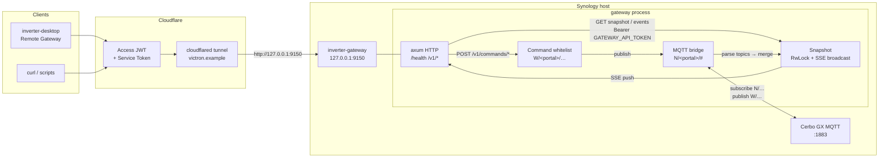

# inverter-gateway

Remote HTTPS/SSE gateway for a Victron Cerbo GX, fronted by Cloudflare
Tunnel + Cloudflare Access. Subscribes to the local MQTT broker, exposes a
curated JSON snapshot, streams changes over SSE, and accepts a whitelisted
set of commands.

This is the **read-mostly** remote layer for [inverter-desktop](https://github.com/victron-venus/inverter-desktop):
the desktop app polls `/v1/snapshot` (and can stream `/v1/events`) through
Cloudflare Access + a bearer token, instead of talking to Cerbo MQTT on the LAN.

## How it works



**Data path (read):** Cerbo publishes `N/<portal_id>/…` → MQTT bridge merges into an
in-memory snapshot → clients `GET /v1/snapshot` or subscribe to `GET /v1/events` (SSE).

**Command path (write):** `POST /v1/commands/{name}` → whitelist only → publish
`W/<portal_id>/…` on MQTT. Unknown names return 404 (no raw passthrough).

**Auth layers:** Cloudflare Access at the edge (primary), then app bearer
`GATEWAY_API_TOKEN` (required unless `GATEWAY_ALLOW_INSECURE=1`). `/health` stays
open for probes and reports `mqtt_connected`.

## Endpoints

| Method | Path | Auth | Purpose |
|---|---|---|---|
| `GET` | `/health` | none | Liveness (returns `mqtt_connected` status) |
| `GET` | `/v1/snapshot` | **required** | Curated JSON snapshot |
| `GET` | `/v1/events` | **required** | SSE stream of snapshot updates |
| `GET` | `/v1/commands/{name}` | **required** | Returns 404 if command unknown |
| `POST` | `/v1/commands/{name}` | **required** | Executes whitelisted command |

### Auth model

* **Edge: Cloudflare Access** validates the user before traffic reaches the
  tunnel. This is the primary barrier.
* **App: bearer token** is required by default (`GATEWAY_API_TOKEN`).
  If `GATEWAY_API_TOKEN` is unset and `GATEWAY_ALLOW_INSECURE` is not `1`,
  the application exits at startup with a clear error. Set
  `GATEWAY_ALLOW_INSECURE=1` only as a local LAN escape hatch — the server
  prints a loud warning on boot.
* Commands are whitelist-only — no raw MQTT passthrough.

### /health

Returns `mqtt_connected` reflecting the live MQTT connection state:

```json
{"status":"ok","mqtt_connected":true}
```

`/health` is intentionally unauthenticated (used by k8s/CF health probes).

## Configuration

| Env var | Default | Description |
|---|---|---|
| `MQTT_HOST` | — | Cerbo host (required) |
| `MQTT_PORT` | `1883` | Cerbo MQTT port |
| `MQTT_USERNAME` | — | Victron MQTT user |
| `MQTT_PASSWORD` | — | Victron MQTT password |
| `MQTT_CLIENT_ID` | `inverter-gateway` | MQTT client id |
| `VICTRON_PORTAL_ID` | — | Portal id → builds `N/<portal_id>/` prefix automatically |
| `VICTRON_TOPIC_PREFIX` | `N/<portal_id>/` | Victron topic prefix. **Replace with your real portal id.** |
| `HTTP_BIND` | `127.0.0.1:8080` | App bind. Docker compose overrides to `0.0.0.0:8080` inside the container; host publish is `127.0.0.1:9150:8080` |
| `GATEWAY_API_TOKEN` | — | Bearer token (required; set `GATEWAY_ALLOW_INSECURE=1` for local tests) |
| `GATEWAY_ALLOW_INSECURE` | `0` | Set `1` to skip token check (local LAN only) |
| `GATEWAY_CORS_ORIGINS` | (none) | Comma-separated allowed origins; empty = same-origin only |
| `RUST_LOG` | `info,inverter_gateway=debug` | tracing filter |

### Finding your portal id

The `VICTRON_TOPIC_PREFIX` must match your Cerbo's VRM portal id. To find it:

1. Open **VRM Portal** → your device → "Info" → "System instance".
2. Or run `dbus-spy` on Cerbo and look at the MQTT root topic.
3. Example: `N/abc123def/` — `abc123def` is the portal id.

### CORS

By default no CORS headers are added (same-origin policy). If a browser
app needs to call the API directly, set `GATEWAY_CORS_ORIGINS` to the
origin(s), e.g. `https://app.example.com`.

## Run locally

```bash
cp .env.example .env
# fill in Cerbo creds and set GATEWAY_API_TOKEN
# optionally GATEWAY_ALLOW_INSECURE=1 for quick local tests

cargo run --release
# or
docker compose -f docker-compose.example.yml --env-file .env up --build
```

## Deploy script

```bash
cp .env.example .env   # gitignored secrets — fill real MQTT / portal / token
./deploy.sh            # default SSH host: synology
./deploy.sh other-host # optional: any SSH host with Docker
```

`deploy.sh` rsyncs the repo to `/volume1/docker/inverter-gateway` (override with `REMOTE_DIR`), copies `.env` with mode `600`, then `docker compose build && up -d`. Never commits `.env`.

## Deploy on Synology (LAN) via Cloudflare Tunnel

1. **Container Manager → Project → Create**, point at the cloned repo, no
   environment file change. Or `docker compose up -d` over SSH.
2. **Cloudflare Zero Trust → Access → Tunnels** — reuse the existing tunnel
   that already fronts your other services.
3. Add a public hostname:
   * Subdomain: pick one (e.g. `gateway.example.invalid`)
   * Service: `http://127.0.0.1:9150`
   * Path: leave empty
4. **Access policy**: pin a single email (or IdP group) and require MFA.
5. Only loopback is published on the host (`127.0.0.1:9150` → container `:8080`);
   nothing is published to the LAN beyond what the tunnel loopback already exposes.

### Docker bind address

Inside the container the process must listen on `0.0.0.0:8080` so Docker
port-publishing works. Set `HTTP_BIND=0.0.0.0:8080` in the compose service
environment (override), while the host-side port mapping stays loopback-only:
`127.0.0.1:9150:8080`. Never bind `0.0.0.0` on the host.

The repository contains no real hostname, tunnel id, or credential. The
deployment configuration lives in
`~/victron/terraform-github-victron/local.secrets.tfvars` (out of scope for
this repo).

## Whitelisted commands (v1)

| Name | Write topic | Payload | Notes |
|---|---|---|---|
| `silence_alarm` | `W/<portal_id>/vebus/0/Alarm` | `{"SilenceAlarm":"1"}` | Acknowledge active alarm |
| `acknowledge_all_notifications` | `W/<portal_id>/platform/0/Notifications/AcknowledgeAll` | `{"value":1}` | Dismiss Venus GUIv2 banners (per-slot ack is often ignored) |

MQTT subscriptions use `N/<portal_id>/` (read). Command publications use
`W/<portal_id>/` (write). Both are derived from `VICTRON_PORTAL_ID` or
`VICTRON_TOPIC_PREFIX`.

Adding a command: edit `src/whitelist.rs::builtin_whitelist`. Anything not
in that table returns 404.


## Performance notes

Cerbo MQTT is very chatty. The gateway:

* stores only leaf paths the desktop mapper needs (drops `settings/+` and other noise);
* updates the in-memory snapshot in place;
* **does not** clone/broadcast on every MQTT message when no SSE clients are connected;
* coalesces SSE pushes to at most ~1/s when clients are connected.

Desktop Remote Gateway polls `GET /v1/snapshot` (no SSE required).

## Development

```bash
cargo fmt
cargo clippy --all-targets -- -D warnings
cargo test
```

CI runs the same three commands on every PR.

## License

MIT — see [LICENSE](LICENSE).
