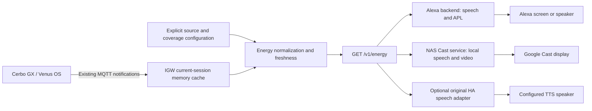
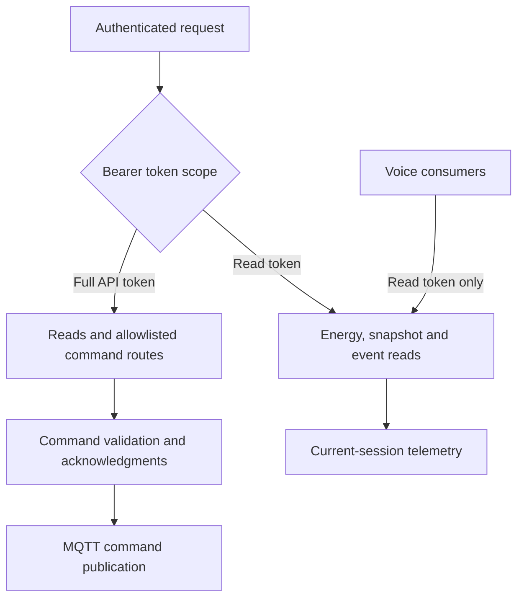
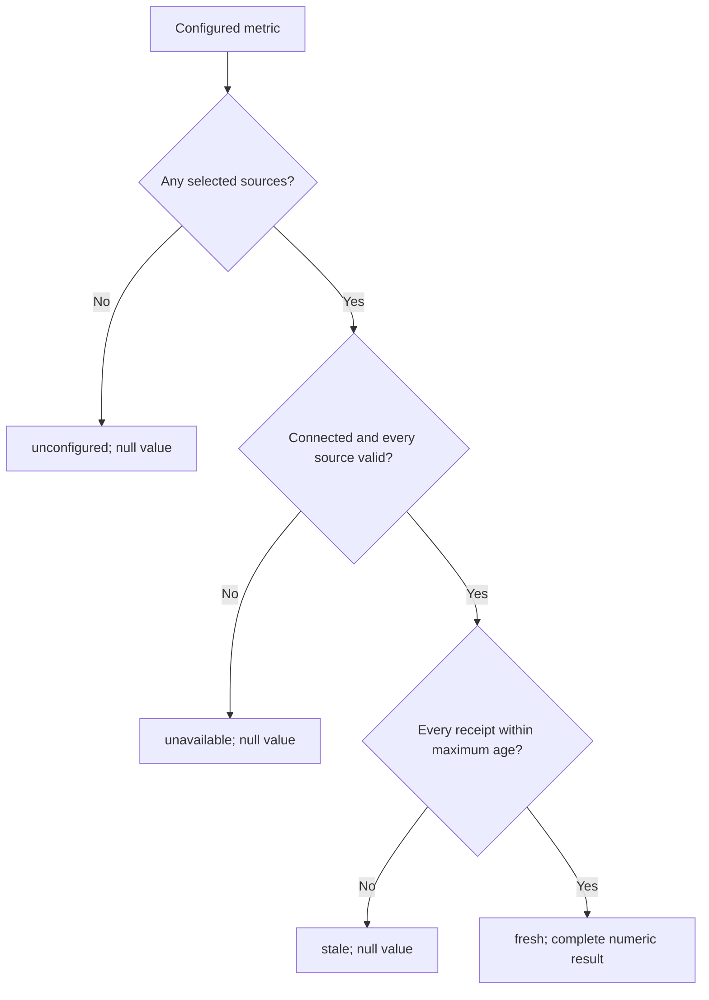
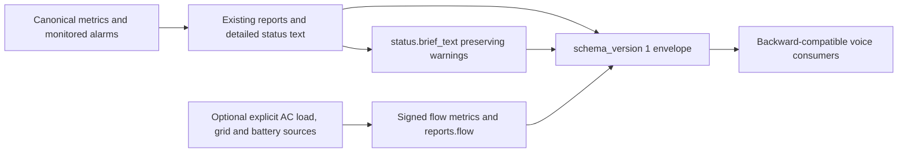

# Inverter Gateway energy architecture

IGW is a server-side MQTT-to-HTTP gateway. Its general command API and its
read-only voice API have separate authorization scopes. This document focuses
on energy reports and their Alexa/Google consumers.

## Sources, normalization and consumers

Source configuration selects the actual telemetry topology. Voice reads use the
existing cache; they do not start a new MQTT scan or run computation on Cerbo.
IGW defines units, aggregation, signs, freshness and central English wording.
Adapters own presentation, authorization to a household, transport and playback.

## Read scope and write scope

Voice consumers receive no full command token or MQTT credentials. HTTPS,
Cloudflare Access and a tunnel may protect the HTTP route, but do not replace
the gateway's token scopes. See [transport security](docs/transport-security.md)
and the [energy API contract](docs/energy-api.md).

## Freshness is part of the result

The oldest required gateway receipt controls a metric's age. A generated
envelope timestamp does not refresh telemetry. Reconnection starts with an empty
current-session cache. Missing components do not turn into a partial total or
zero; a real numeric zero remains valid. Receipt freshness is not a guarantee
that the upstream sensor took a new physical measurement.

## Additive voice features

The five original reports retain their detailed text. The additive brief field
provides shorter normal speech without dropping alarm or data-quality notices.
Legacy consumers can ignore it.

Optional flow configuration adds `load_power`, `grid_power` and `battery_power`
in watts. The flow report describes configured AC consumption, signed grid
import/export and battery charging/discharging. It does not infer grid loss,
full-house coverage, usable battery capacity or overnight autonomy. Every
selected phase and measurement point must match the installation; unsupported
or overlapping selections are rejected. See the contract for supported paths
and sign conventions.

No historical database, forecast service or tariff engine is added. No flow
configuration changes the default status report or enables control operations.

## Deployment and acceptance

Deploy the gateway change before enabling new adapter features. Old adapters
continue using existing fields; new adapters fall back when optional fields are
absent. Keep source selections private and independently verify them against
trusted telemetry. Synthetic fixtures prove contract compatibility, not a home's
topology or the complete signed-Amazon/Google voice path.

Run the Rust suite and existing repository checks, then verify authenticated
read access, source freshness and signed flow direction on the actual gateway.
Keep the prior binary/image and configuration for rollback. Consumer deployment,
account linking, model import and physical playback are separate acceptance steps.
